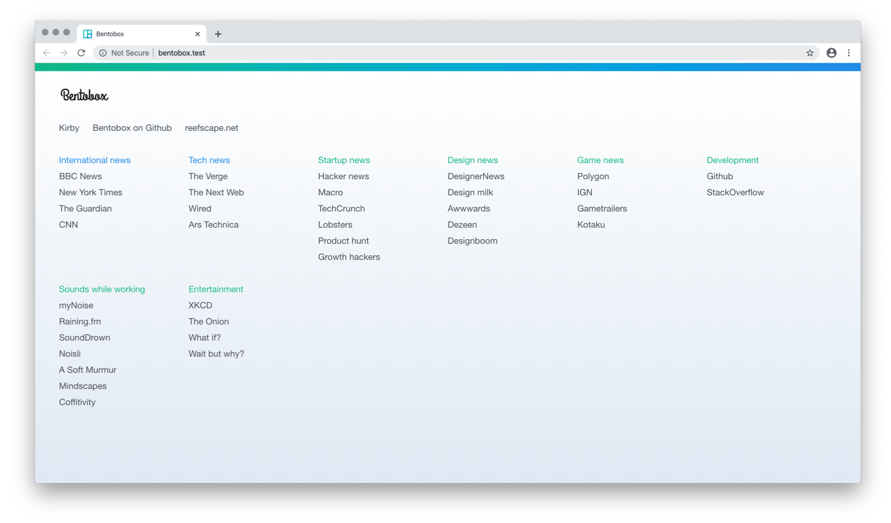

# Bentobox
A simple theme to create a new tab link page using the Kirby CMS

## About

Bentobox is a very simple theme for [Kirby](http://getkirby.com). I was looking for a very clean customisable new tab page but none of the existing ones fitted my needs. They either had too much design, too much functionality or could not be customised completely.

For optimal speed I host this page on a local server running on my computer. Using Dropbox I sync the contents between computers.

## What is Kirby?
[Kirby](http://getkirby.com) is a lightweight, flexible and file-based CMS made by [Bastian Allgeier](http://bastianallgeier.com).

## Installation
The installation is the same as with any other Kirby theme.

1. First download and install Kirby. You can download the starter kit either from [GetKirby.com](https://getkirby.com/downloads) or [Github](https://github.com/getkirby/starterkit). Alternatively you can install Kirby using the [command line interface](https://getkirby.com/docs/installation/running-with-php).
- Check if the installation is running properly. Don't forget the hidden `.htaccess` file!
- Download this theme.
- Remove the default `/assets`, `/content` folders from the installation and replace them with the downloaded ones. Finally inside the `/site` folder replace the `/blueprints` and `/templates` folders.

View your site in a browser and you should now see a page with demo content. Clicking on the logo brings you to the login and the CMS.

## How to use
Using Bentobox is simple. You can either add or edit links by editing the text files in the `/content` folder or through the Panel (click on the logo). The first time you enter the Panel you will be asked to create an account.

### Editing or adding links
In the `/content` folder each folder corresponds to a block of links. The sort order determines the order on the page. When using the Panel is page is a block of links. See the [Kirby docs](https://getkirby.com/docs) for more instructions.

The first set of links is always displayed horizontally.

### Using as a new tab page
Bentobox was created to be used as a home or new tab page in your browser. In most browsers you can set this directly in the browser settings. In Chrome this is not possible by default but you can redirect to your own page with the [New Tab Redirect](https://chrome.google.com/webstore/detail/new-tab-redirect/icpgjfneehieebagbmdbhnlpiopdcmna) extension.

### Hosting locally
To make the page load faster and work without an internet connection you can host it on your own computer. For example using [MAMP](https://www.mamp.info) or similar.

When hosting locally you can edit your `/etc/hosts` file to get a nicer url. If you don't want to edit that file by hand you can use something like [Gas mask](https://github.com/2ndalpha/gasmask) or [VirtualHostX](https://clickontyler.com/virtualhostx/).

Since Kirby is file based you can sync your page between computers by putting site folder in Dropbox or Google Drive.

### Customise colours
You can tweak the colour theme by editing `assets/scss/_color-scheme.scss` and compiling to a new `bentobox.css` file. In the file different themes are included.

## History

0.1.0 - Initial release

## To do
- Improve rendering flow on Chrome (if possible)

And perhaps in the future
- Make logo customisable
- Make the colours more easily customisable
- Add modules for other content through rss feeds
- Add daily schedule based on calendar
- Make it possible to add notes or actions for the day
- Add or connect to todays to do list
- Option to require login to view page
- Multiple pages of links

## Contributing

Feedback and pull requests are welcome. Best ways to contribute:
* Star it on GitHub - if you use it and like it please star it
* Open [issues/tickets](https://github.com/bcorporaal/Bentobox/issues)
* Submit fixes and/or improvements with [Pull Requests](https://github.com/bcorporaal/Bentobox/pulls)

## Contact
If you have any questions or comments you contact me via [email](mailto:dev@reefscape.net) or [Twitter](http://twitter.com/bcorporaal).

## Credits

Bentobox includes the following:

**Roboto Condensed web fonts** 
Copyright 2011 Google Inc. All Rights Reserved. Licensed under Apache v2.0 license.
https://www.google.com/fonts/specimen/Roboto+Condensed

**Include Media Sass library** 
Licensed under the terms of the MIT license. 
Authors: Eduardo Boucas (@eduardoboucas) and Hugo Giraudel (@hugogiraudel)
http://include-media.com

**Simurai Duotone themes** 
Licensed under the MIT license. 
The included color schemes are based on the [Atom Duotone themes](http://simurai.com/projects/2016/01/01/duotone-themes) created by [Simurai](http://simurai.com/).

## License

Copyright (c) 2016 Bob Corporaal 
Licensed under the MIT license.
